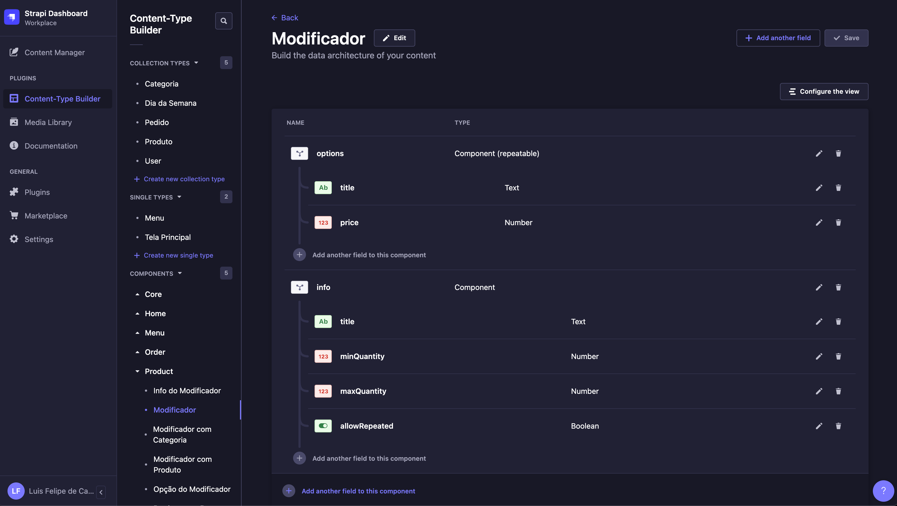
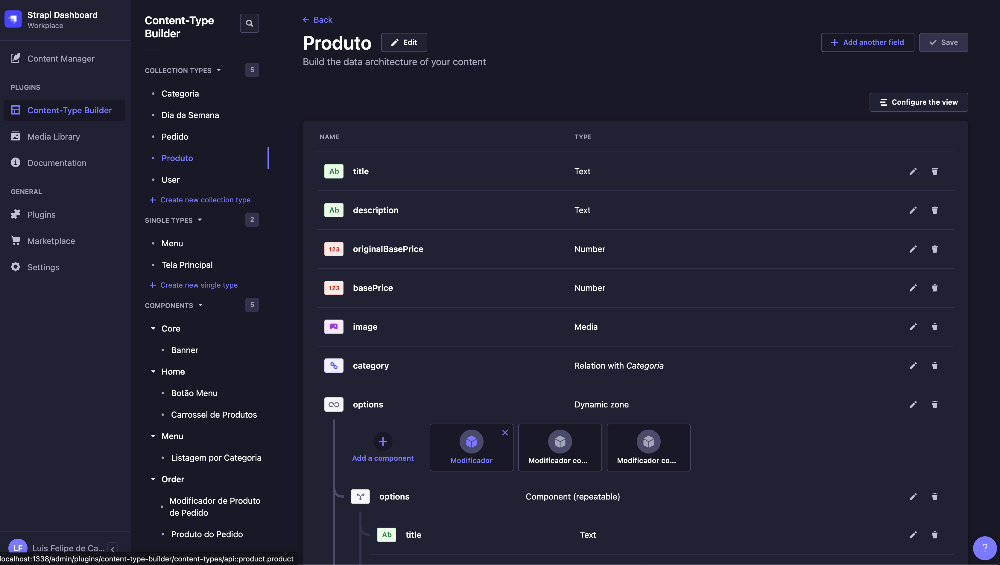
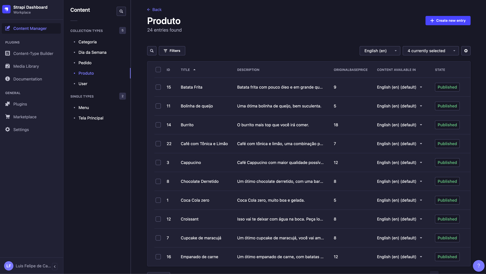
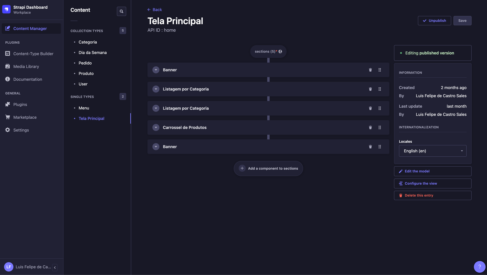
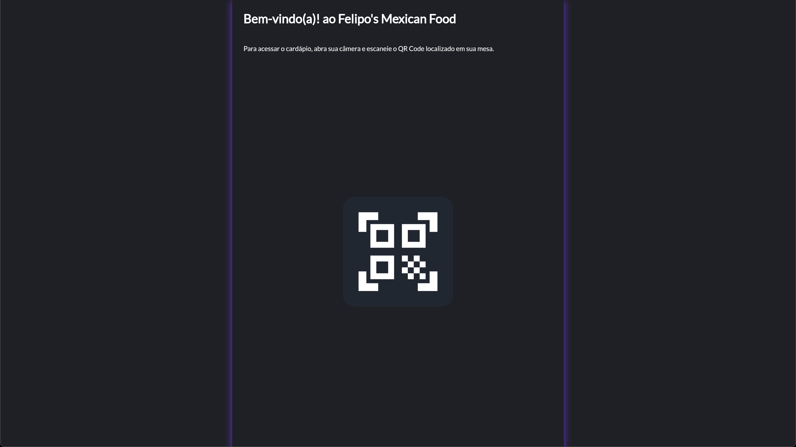
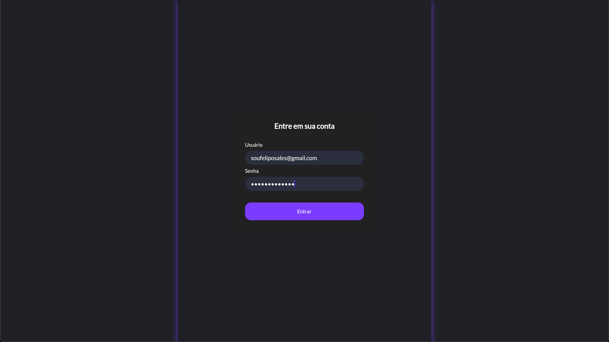
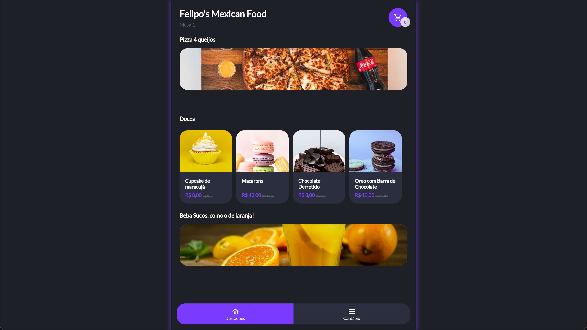
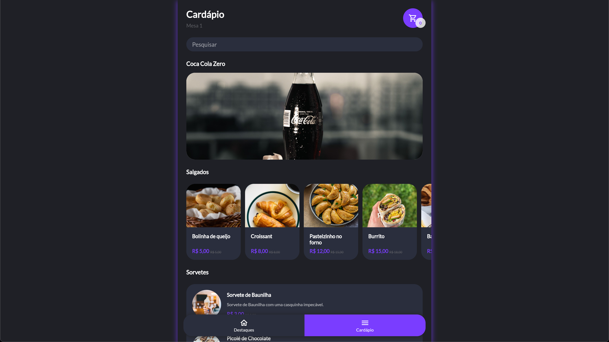
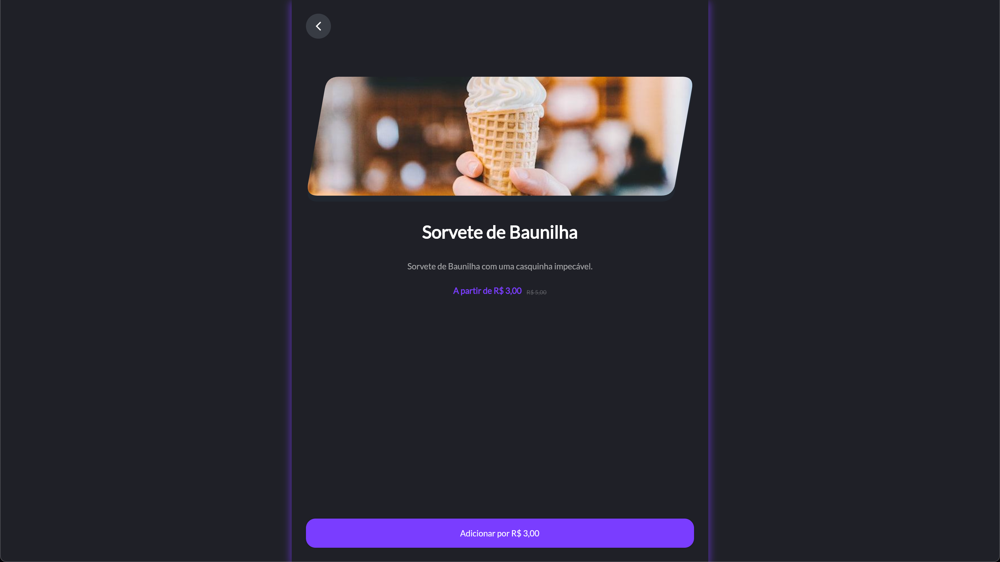
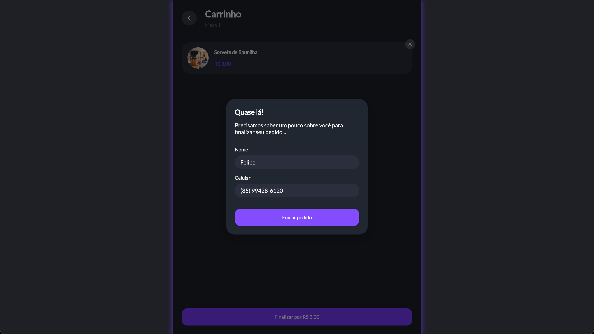

# Flutter Menu

Flutter Menu App is a Flutter app that shows a menu of a restaurant. The app is built with Flutter and Dart, with Strapi as the backend.

See the strapi project in [this repo](https://github.com/felipecastrosales/menu_cms).

This project is developed as part of the Flutter course by [StarttoDev](https://www.startto.dev/), in the course: "PRO: Cardápio Digital + Painel Web com Flutter e Strapi".

## Technologies

Packages used in this project:

- auto_animated
- brasil_fields
- cupertino_icons
- diacritic
- dio
- either_dart
- equatable
- get
- google_fonts
- intl
- loading_animation_widget
- pretty_dio_logger
- In some commits, is used the package provider with ChangeNotifier, but it was removed in the final version.

## Images

### Strapi CMS

Some examples of Strapi CMS: 

- Content Builder
  - 
  - 

- Content Manager
  - 
  - 

### Flutter App

- Application Flow (some examples, only)
  - 
  - 
  - 
  - 
  - 
  - 
